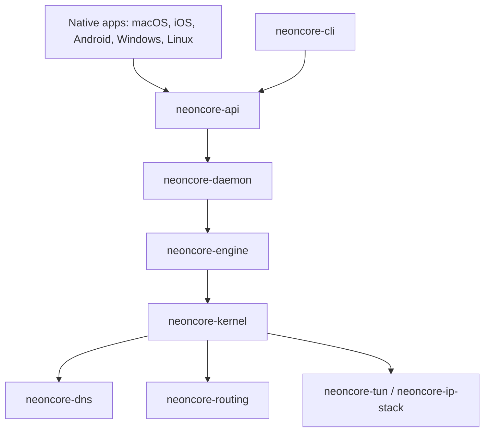

# NeonCore Atlas

**NeonCore Atlas is a next-generation open-source network client and Rust networking kernel for macOS, iOS, Android, Windows, Linux, and the command line.** It is built for people who want one fast, auditable, cross-platform connectivity stack instead of a pile of opaque platform-specific tools.

Atlas combines native apps, a shared Rust control plane, and an in-repository networking kernel named `neoncore-kernel`. The goal is simple and ambitious: a lightweight client that feels polished on every platform while keeping the packet path, protocol adapters, DNS, routing, and observability under one codebase.

## Why Atlas Exists

Modern network clients usually force a trade-off between speed, portability, transparency, and real platform integration. NeonCore Atlas is designed to collapse that trade-off:

- **Owned kernel, no downloaded core binary**: networking behavior lives in this repository.
- **Rust-first performance model**: async I/O, protocol-specific adapters, low-copy flow relays, structured logging, and focused test coverage.
- **Native user experience**: SwiftUI, Kotlin/Compose, WinUI, GTK/libadwaita, and a CLI share the same models and localization strategy.
- **System-level roadmap**: TUN/VPN architecture for IPv4, IPv6, TCP, UDP, DNS interception, and rule-based routing.
- **Protocol depth**: adapter work covers direct, HTTP, SOCKS5, Shadowsocks AEAD/2022, VLESS transports, AnyTLS, and Hysteria2-oriented QUIC paths.
- **Privacy by design**: no bundled credentials, no analytics SDK, no telemetry dependency, and no production subscription URL in the repository.

## Architecture



## Workspace Highlights

| Area | What is inside |
| --- | --- |
| `neoncore-kernel` | Local SOCKS5 and HTTP inbound listeners, outbound adapters, DNS resolution, routing decisions, structured logs, and flow relay infrastructure. |
| `neoncore-tun`, `neoncore-ip-stack` | IPv4/IPv6 packet parsing, TCP/UDP flow metadata, DNS interception primitives, and routing decisions for future system-level mode. |
| `neoncore-core`, `neoncore-api`, `neoncore-engine` | Shared models, API types, and engine boundaries used by apps, daemon, and CLI. |
| Native apps | Platform shells for Apple platforms, Android, Windows, and Linux. |
| i18n | `en-AU`, `zh-Hans`, and `en-XA` localization resources with stable semantic keys. |

## Kernel Capabilities

Atlas is not a UI-only shell. The kernel is an active Rust networking runtime with:

- asynchronous TCP runtime and connection lifecycle management
- SOCKS5 inbound, HTTP CONNECT inbound, HTTP outbound, and direct outbound paths
- DNS host mapping, proxy bootstrap resolution, and IPv4/IPv6 preference handling
- rule-based routing by domain, suffix, keyword, and CIDR
- VLESS TCP/TLS/REALITY plus WS, gRPC, H2, HTTPUpgrade, and XHTTP transport work
- VLESS UDP, XUDP, mux workers, protobuf-compatible addon encoding, and browser-style TLS fingerprint shaping
- AnyTLS session pooling, stream setup, TCP relay, and UDP-over-TCP packet connection work
- Hysteria2-oriented QUIC session management, TCP/UDP framing, datagram handling, reconnectable clients, and custom pacing/congestion work
- structured logs and focused end-to-end tests for local proxy paths

## Platform Targets

| Platform | Integration direction |
| --- | --- |
| macOS | Native app, local kernel process, future Network Extension flow. |
| iOS | SwiftUI app and Packet Tunnel architecture. |
| Android | Kotlin/Compose app and VPNService architecture. |
| Windows | WinUI app, service model, and Wintun direction. |
| Linux | GTK/libadwaita app and tun/tap direction. |
| CLI | Developer and automation surface for status, diagnostics, and profile workflows. |

## Security and Privacy Posture

NeonCore Atlas is designed for public review:

- no real subscription URL or node credential is committed
- example sessions use documentation-only domains and placeholder IDs
- Research material is ignored by Git and not part of the distributable project surface
- secrets stay in user configuration, not in source code
- security-sensitive changes should include tests and a reviewable threat model

## Build

```sh
cargo fmt --all
cargo test -p neoncore-kernel
cargo test --workspace
cargo run -p neoncore-cli -- status
```

Platform apps may require their native SDKs. See the platform README files under `apps/` and `platform/`.

## Project Status

NeonCore Atlas is under active development. The Rust workspace builds, the macOS app can import subscriptions and start the local kernel, and the kernel already contains real networking paths. TUN/VPN integration and production hardening are ongoing.

This project is intentionally ambitious: the long-term target is a compact, extremely fast, memory-conscious network client stack that can be studied, audited, extended, and shipped across platforms.

## Contributing

Pull requests are welcome when they keep the project fast, readable, secure, and testable. Please keep public code comments and documentation in English, avoid committing service credentials, and keep platform-specific code behind clear adapters.

See [CONTRIBUTING.md](CONTRIBUTING.md), [SECURITY.md](SECURITY.md), and [CODE_OF_CONDUCT.md](CODE_OF_CONDUCT.md).

## License

NeonCore Atlas is licensed under the [Apache License 2.0](LICENSE).
