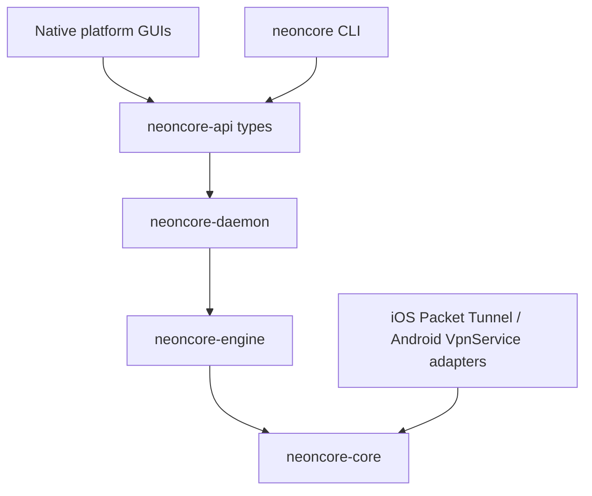

# NeonCore Atlas

NeonCore Atlas is an open-source advanced network client scaffold for desktop and mobile platforms. It is designed for native apps, shared Rust core logic, and future pluggable proxy/VPN engine support, while keeping the first version focused on long-term architecture instead of production VPN or proxy tunneling.

NeonCore Atlas does not include paid service credentials, analytics, telemetry, or real traffic tunneling in this initial scaffold.

## Architecture



- `neoncore-core`: pure Rust profile, node, subscription, routing, and state models.
- `neoncore-engine`: engine abstraction for the owned `neoncore-kernel` runtime.
- `neoncore-kernel`: the owned local networking kernel binary.
- `neoncore-api`: serde-compatible local API request and response types shared by CLI, daemon, and GUIs.
- `neoncore-daemon`: desktop service process scaffold for Windows, macOS, and Linux.
- `neoncore-cli`: cross-platform command-line client with localized output.
- Native apps: SwiftUI for Apple platforms, Kotlin/Compose for Android, WinUI 3 for Windows, GTK4/libadwaita for Linux.
- Capability scaffolds: subscriptions, profiles, routing rules, DNS settings, rewrite rules, latency tests, traffic statistics, diagnostics, and profile export.

## Platform Matrix

| Platform | UI | VPN/service integration | Status |
| --- | --- | --- | --- |
| iOS | SwiftUI | Network Extension Packet Tunnel Provider | Scaffold |
| Android | Kotlin + Jetpack Compose | Android `VpnService` | Scaffold |
| macOS | SwiftUI | Network Extension/helper | Scaffold |
| Windows | WinUI 3 / Windows App SDK | Windows Service, Wintun later | Scaffold |
| Linux | GTK4 + libadwaita | systemd service, TUN later | Scaffold |
| Desktop CLI | Rust + clap | Talks to daemon and kernel | In progress |

## Internationalization

English (Australia) (`en-AU`) is the source language. Initial locales are `en-AU`, `zh-Hans`, and pseudolocale `en-XA`. Production UI, CLI, daemon status, errors, accessibility labels, and tooltips should use localization resources from the first commit. See [i18n/README.md](i18n/README.md).

## Build

```sh
cargo test --workspace
cargo run -p neoncore-cli -- status
cargo run -p neoncore-cli -- diagnostics
cargo run -p neoncore-cli -- stats
cargo run -p neoncore-daemon -- health
```

Platform app folders contain native project skeletons and local README files where additional SDK tooling is required.

## Current Status

This repository is a real starting scaffold. It compiles the Rust workspace, includes models and tests, demonstrates native UI/i18n structure, and parses subscription node records in the macOS app. Full proxy transport adapters, VPN, TUN, firewall integration, and daemon IPC are still in progress.
